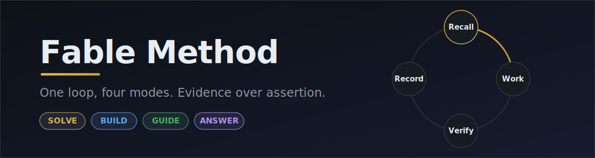
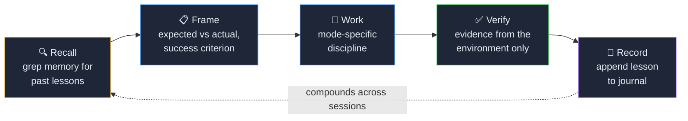
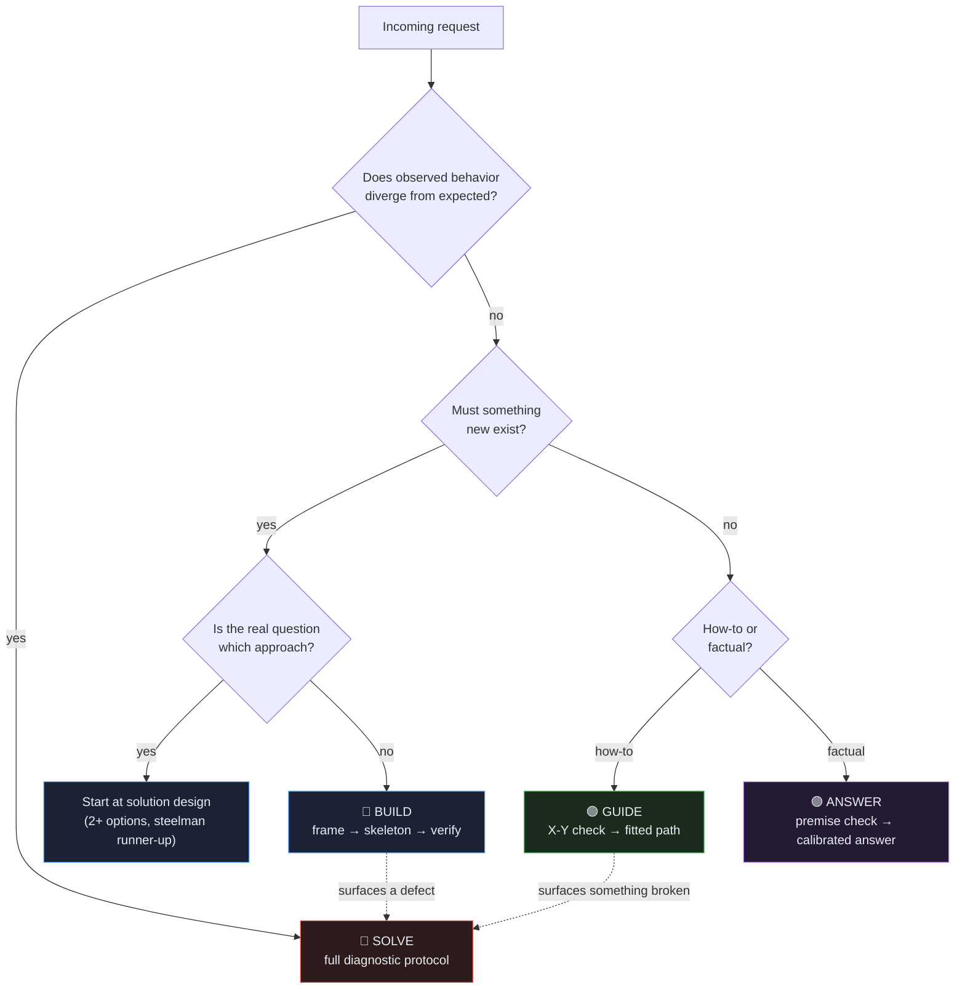
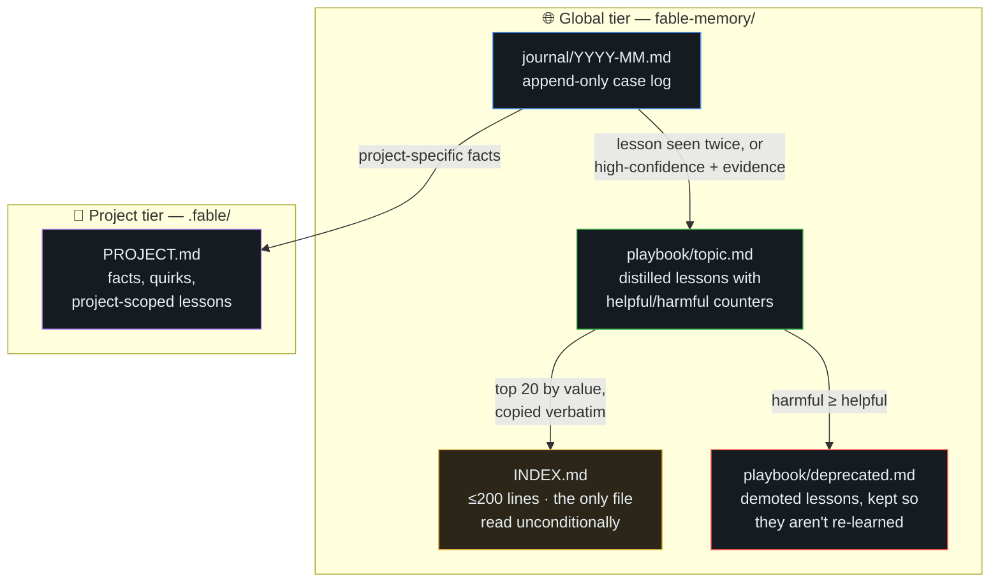

<p align="center">
  
</p>

# Fable Method

A working protocol for AI agents (Claude Code, Cowork, and compatible skill runners) that turns one-off sessions into compounding performance. One loop — **Recall → work with discipline → verify with evidence → Record** — applied through four modes, backed by a persistent, grep-able memory system.

Every rule in the protocol exists to block a documented agent failure mode: acting before understanding, first-hypothesis fixation, confident false success claims, big-bang builds that fail at the end, answering false premises literally, and re-learning the same lessons every session.

## The core loop



Recall and Record are unconditional for SOLVE and BUILD work — that is what makes performance compound instead of resetting every session.

## Four modes

The loop stays constant; the modes change what "the work" is.

| Mode | Trigger | Spine |
|---|---|---|
| **SOLVE** | Observed behavior diverges from expected | Frame → triage tier → diagnose → design fix → execute in checkpoints → verify |
| **BUILD** | Nothing broken; something new must exist | Frame criteria/non-goals → design (2 options) → walking skeleton → increment → verify against frame |
| **GUIDE** | "How do I X?" | Real-goal check → context-fitted steps with observable checkpoints and real pitfalls |
| **ANSWER** | Factual question with stakes | Premise check → calibrate → verify volatile facts → answer directly |



Dispatch rule: divergence-from-expected always wins. A GUIDE or BUILD request that surfaces something broken becomes SOLVE.

## Triage tiers (SOLVE)

Ceremony scales with stakes. The protocol is how the agent thinks, not a format for replies — trivial fixes get the discipline silently; visible framing and hypothesis ledgers are reserved for work that earns them.

```mermaid
flowchart LR
    T1["T1 Quick<br/>cause obvious, low stakes,<br/>reversible"] --> P1["fix → verify →<br/>one-line journal entry"]
    T2["T2 Standard<br/>cause non-obvious OR<br/>moderate stakes"] --> P2["≥2 hypotheses,<br/>≥2 fix options,<br/>short entry"]
    T3["T3 Deep<br/>high stakes, intermittent,<br/>cross-system, or 2 failed fixes"] --> P3["full protocol,<br/>reference files,<br/>full entry"]
    P1 -.->|"2 failed attempts"| T2
    P2 -.->|"2 failed attempts"| T3
    style T1 fill:#1a2b1e,stroke:#3fb950,color:#e6edf3
    style T2 fill:#2b2617,stroke:#e3b341,color:#e6edf3
    style T3 fill:#2d1a1a,stroke:#f85149,color:#e6edf3
    style P1 fill:#161b22,stroke:#30363d,color:#9198a1
    style P2 fill:#161b22,stroke:#30363d,color:#9198a1
    style P3 fill:#161b22,stroke:#30363d,color:#9198a1
```



The escalation rule: two failed fix attempts means the model of the problem is wrong. Escalate one tier and re-frame from scratch — thrashing pollutes the agent's own context and measurably degrades reasoning.

## The memory system

Two tiers, append-only, retrieved by grep rather than bulk loading. Design follows what measurably works in agent-memory research (itemized playbooks with helpful/harmful counters, delta-only edits, selective gated storage) and guards against the documented failure modes: whole-file rewrites collapsing memory, unbounded growth burying signal, and over-generalized quirks becoming confident wrong answers.



Key mechanics, each earned by a documented failure:

- **Append-only journal, delta-only edits.** Whole-file rewrites are the published cause of catastrophic memory collapse (one case: 18k tokens rewritten to 122 in a single step, performing worse than no memory).
- **Gated promotion.** A lesson enters the playbook only if generalizable, evidence-linked, and not already there. Controlled studies found agents that stored everything performed worse than agents that stored selectively.
- **Honest counters.** Every playbook bullet carries `helpful:` / `harmful:` counts updated after each application — outcomes are free quality labels, and consolidation demotes bullets that mislead.
- **Grep, don't browse.** Retrieval keys off exact error strings and tags in entry headers; loading more than ~3 journal entries is treated as a smell.

## What each rule blocks

| Documented failure mode | Countermeasure |
|---|---|
| Acting before understanding | Frame written before any work |
| First-hypothesis fixation (Einstellung effect) | ≥2 hypotheses in diagnosis; ≥2 options in design |
| Confident false success (44–52% of agent task failures in a 2026 benchmark study) | Verification = evidence from the environment, never self-assessment |
| Big-bang build failing at the end | Walking skeleton first, per-increment verification |
| Answering a false premise literally | Premise check precedes every answer |
| X-Y literalism | Real-goal check in GUIDE |
| Stale facts asserted confidently | Volatile facts verified or explicitly labeled unverified |
| Thrashing / context self-pollution | Two failures → escalate tier, re-frame from scratch |
| Symptom patch at the wrong level | Cause-fix vs mitigation declared; bandaids recorded as debt |
| Re-learning lessons every session | Recall and Record unconditional for SOLVE/BUILD |
| Memory collapse / bloat / staleness | Append-only journal, gated promotion, capped index, counters |

Provenance for every empirical claim is in [`references/sources.md`](references/sources.md).

## Repository layout

```
fable-method/
├── SKILL.md                    # Entry point — the compressed protocol, all four modes
├── references/
│   ├── diagnosis.md            # Full SOLVE toolkit: IS/IS-NOT, bisection, domain playbooks
│   ├── solutioning.md          # Option generation, steelmanning, pre-mortems, decision records
│   ├── execution.md            # Checkpointed execution, verification patterns, incident mode
│   ├── building.md             # BUILD: framing, walking skeleton, edge-case prediction
│   ├── answering.md            # ANSWER/GUIDE: premise taxonomy, calibration, how-to structure
│   ├── memory.md               # Memory layout, schemas, write/read/consolidation protocols
│   └── sources.md              # Provenance for every empirical claim
├── docs/
│   ├── installation.md         # Install on Claude Code, Cowork, and claude.ai
│   └── architecture.md         # Design walkthrough with diagrams
├── assets/
│   └── banner.svg
└── LICENSE                     # MIT
```

The skill is progressive-disclosure by design: `SKILL.md` is always loaded; reference files are read only when the work reaches the step they cover.

## Installation

**Claude Code** — copy the skill into your skills directory:

```bash
git clone https://github.com/<you>/fable-method.git
mkdir -p ~/.claude/skills
cp -r fable-method ~/.claude/skills/fable-method
```

**Cowork / Claude Desktop** — add it as a skill in Settings → Capabilities, or zip the folder as `fable-method.skill` and open it.

Full instructions, including the memory-tier bootstrap and a claude.ai degraded mode, in [`docs/installation.md`](docs/installation.md).

## Usage

The skill self-triggers on intent — reports of broken behavior, requests to build or automate, how-to questions, factual questions with stakes. On first substantive use in a folder it offers to bootstrap the memory tiers (two small markdown files); every subsequent session recalls before working and records after.

To make it your default way of working, add a line like this to your preferences or `CLAUDE.md`:

> I use the fable-method skill as my default working protocol. Invoke it for any substantive work; never skip its Record step.

## License

MIT — see [LICENSE](LICENSE).
