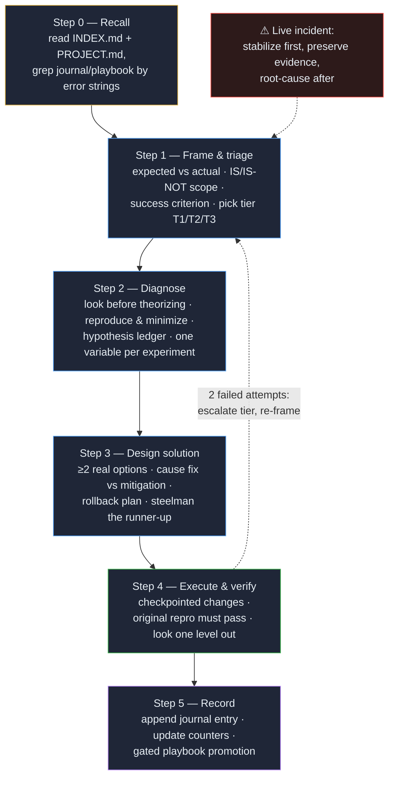
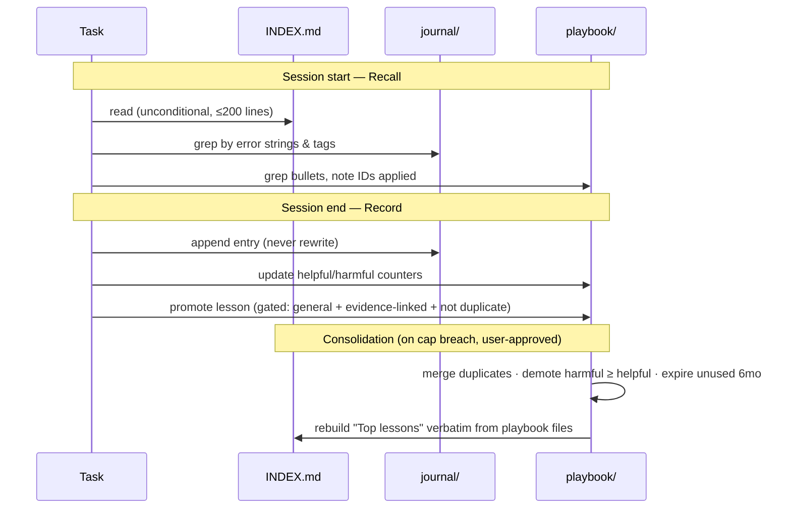

# Architecture

How the pieces fit, and why each one exists. Every design choice here traces to a documented failure mode of agent work; the provenance lives in [`../references/sources.md`](../references/sources.md).

## Progressive disclosure

`SKILL.md` is the only file loaded at invocation — a deliberately thin core carrying the non-negotiables, mode dispatch, tiering rules, and verification essentials. Everything detailed loads by tier: T1 work loads nothing; T2 loads `protocol.md` (and `deep-execution.md` when the task has executable or computable artifacts); T3 pulls the deep references as each step needs them. This keeps trivial tasks cheap and deep tasks fully equipped.

```mermaid
flowchart TD
    S["SKILL.md — thin core<br/>non-negotiables · dispatch ·<br/>tiering · essentials"]
    S -->|"T2+: forms, ledger,<br/>checklists, reply contract"| P["references/protocol.md"]
    S -->|"T2+ with executable or<br/>computable artifacts"| DE["references/deep-execution.md"]
    S -->|"orchestrating subagents,<br/>budgeting spend"| TE["references/token-economy.md"]
    S -->|"T3 diagnosis, stuck at T2,<br/>intermittent, data discrepancy"| D["references/diagnosis.md"]
    S -->|"consequential or<br/>contested fix choice"| SO["references/solutioning.md"]
    S -->|"high-stakes changes,<br/>incidents, reviews"| E["references/execution.md"]
    S -->|"non-trivial builds"| B["references/building.md"]
    S -->|"high-stakes answers,<br/>suspect premises"| A["references/answering.md"]
    S -->|"bootstrap, T2+ entries,<br/>promotion, consolidation"| M["references/memory.md"]
    S -->|"unsure what good looks like<br/>for this mode and tier"| X["references/examples.md"]
    style S fill:#2b2617,stroke:#e3b341,color:#e6edf3
    style P fill:#1f2637,stroke:#58a6ff,color:#e6edf3
    style DE fill:#1f2637,stroke:#58a6ff,color:#e6edf3
    style TE fill:#1f2637,stroke:#3fb950,color:#e6edf3
    style D fill:#161b22,stroke:#30363d,color:#e6edf3
    style SO fill:#161b22,stroke:#30363d,color:#e6edf3
    style E fill:#161b22,stroke:#30363d,color:#e6edf3
    style B fill:#161b22,stroke:#30363d,color:#e6edf3
    style A fill:#161b22,stroke:#30363d,color:#e6edf3
    style M fill:#161b22,stroke:#30363d,color:#e6edf3
    style X fill:#161b22,stroke:#30363d,color:#e6edf3
```



## The SOLVE pipeline

The full protocol, with the reference file backing each step:



Three load-bearing rules:

- **Verification is evidence from the environment, never self-assessment.** A 2026 benchmark study found 44–52% of agent task failures were confident false-success claims, and chain-of-thought provided no protection — traces rationalized completion rather than verifying it. The success claim is the Step 1 criterion passing, with output quoted.
- **Two hypotheses, two options, mechanically.** The Einstellung effect (from the 1942 water-jar experiments to modern chess eye-tracking) shows a familiar first solution actively suppresses perception of better ones while the solver believes they are still searching. Introspection cannot fix this; producing a second real option before evaluating the first can.
- **Two failures → escalate and re-frame.** Failed attempts accumulate in the agent's context and degrade subsequent reasoning. Stepping back to a clean frame is faster than a third variation.

## The memory lifecycle



The asymmetry is deliberate: writes to the journal are cheap; writes to the playbook are expensive and gated. Research on agent memory found selective storage beats store-everything, and that outcome counters — free quality labels — are what keep a distilled playbook trustworthy. The one operation that is never allowed is regenerating a whole memory file from context: whole-file rewrites are the documented cause of catastrophic memory collapse.

Two gates refine what gets written at all. The **rediscovery gate**: a full entry is earned only when a fresh frontier model could not cheaply re-derive the lesson from the artifacts alone (diagnosis took many tool calls, needed information outside the workspace, or a first attempt failed) — everything else gets a one-liner or nothing. The **provenance rule**: constraints that exist only outside the artifacts (verbal mandates, vetoes, contractual interfaces) are recorded with their *authority*, not just their content — a future session reading only the code cannot distinguish a mandate from a preference, and recorded authority is the one channel no model capability replaces.

## Journal entry anatomy

The header line is the retrieval target — future sessions grep it with the exact error text they are seeing:

```markdown
### 2026-07-07 | tags: pdf-export, fonts | project: acme-reports | outcome: solved
- Problem: <symptom, with exact error text — the future search signature>
- Context: <environment, versions, conditions>
- Contributing cause(s): <plural on purpose — what the evidence supports>
- Ruled out: <hypotheses tested and killed, with the killing evidence>
- Fix: <precise enough to repeat — commands, paths, settings>
- Verified by: <the actual evidence — output, recomputed figure, passing test>
- Lesson: [scope: <where this applies>] [confidence: high|med|low] <one sentence>
```

`Ruled out` pays for itself the first time a future session skips a dead end. `Lesson: none — case-specific` is a valid and common outcome; an unscoped lesson is a future over-generalization.

## Ceremony scaling

The protocol is how the agent thinks, not a reply format. T1 fixes and trivial answers get the discipline silently — no step headers, no protocol narration. Visible framing, hypothesis ledgers, and briefs appear only at T2+ and in non-trivial builds, where the structure earns its space. The one mandatory disclosure at every tier: when memory files are created or modified, say what and where.

Ceremony also calibrates to **model class**, not just stakes: frontier models default one tier lighter and escalate reactively after the first failed attempt (benchmarks show they pass most guardrail checks unprompted, so ceremony is paid for reactively); smaller models take the stakes table at face value, and additionally load `deep-execution.md` on executable work — which converts frontier habits like symptom ledgers with zero-residual accounting, independent recomputation, and probe-don't-simulate into mechanical procedure. High stakes or irreversibility force full ceremony regardless of model.

## The token-economy layer

Cost discipline sits beside — never above — the quality gates: every verification form and reply-contract row binds regardless of which model does the work. The ladder: deterministic tools first (no model reads what grep or SQL can compute); measure the reading volume before fanning out (each subagent carries a ~20–25k-token setup floor, so small jobs stay with one reader); then the cheapest adequate class per leg — Haiku-class reads and extracts (returning evidence, never conclusions), Sonnet-class executes, and the strongest model in session frames, adjudicates, and signs off. Delegating judgment below its minimum tier is the failure the layer exists to prevent: a wrong cheap answer costs more than the delta to the right model. Full role matrix, brief templates, and cost accounting: `references/token-economy.md`.
